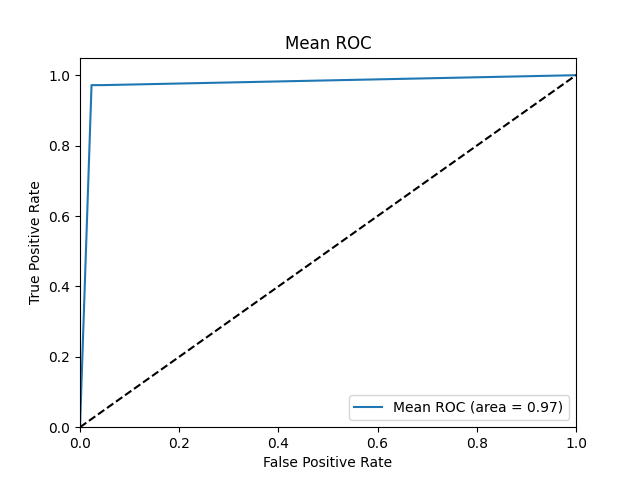

# 机器学习课程设计

实验目的：进行糖尿病预测，使用Sk-learn diabetes，二分类任务

数据集分析：这是一个含有400+实例，10个特征的数据集。

机器学习方法：

1. 贝叶斯决策+AODE等改进
2. K-SVM
3. 特征选择：过滤式选择：Relief
4. 降维：PCA主成分分析，与Relief不同，它不会直接扔掉一个特征，而是使用新坐标系下的特性进行训练。

针对以上问题，我们展开实验。

首先是准备数据集，我们不必要进行任何数据分析，只需要准备交叉验证。

## 模型评估

1. 测试集

本数据集是否有预制的测试集？

若无，则先固定选择1/10的示例来作为测试集。测试集在整个训练过程中不参与训练，只是在模型训练完毕后，用于验证模型性能。

2. 评估方法

鉴于本实验的示例数目并不多，我们采用10折交叉验证。

3. 性能度量

使用准确率、F1、ROC曲线。

基于本实验内容并无要求手写模型评估的任何内容，所以我们直接尝试使用Sk-Learn来完成这部分工作。

## 特征工程

这一部分我们采用Relief来进行，需要准备一个类来完成相应的工作。具体工作如下：

我并不清楚SKlearn交叉验证的模式。

## 降维

降维在两个模型中都有可能用到，所以我们直接准备一个降维类即可。

## 贝叶斯类


## 核支持向量机类

          precision    recall  f1-score   support
    
      -1       1.00      0.79      0.88        43
       1       0.89      1.00      0.94        71
       
       

accuracy                           0.92       114
macro avg      0.94      0.90      0.91       114
weighted avg   0.93      0.92      0.92       114


```
              precision    recall  f1-score   support

          -1       0.38      1.00      0.55        43
           1       1.00      0.00      0.00        71

    accuracy                           0.38       114
   macro avg       0.69      0.50      0.27       114
weighted avg       0.77      0.38      0.21       114
```


```
              precision    recall  f1-score   support

          -1       0.95      0.49      0.65        43
           1       0.76      0.99      0.86        71

    accuracy                           0.80       114
   macro avg       0.86      0.74      0.75       114
weighted avg       0.83      0.80      0.78       114
```
### Fit 函数解析

fit函数是KernelSVM模型的训练方法，它的目标是根据输入的训练数据集(X, y)，学习一组支持向量及其对应的参数$\alpha$和偏置项b。

以下是对fit函数主要步骤的详细解释：

1. **初始化**：函数首先获取样本数量(n_samples)和特征数量(n_features)。然后，计算核矩阵K，该矩阵在SVM中起着重要作用。随后，初始化参数$\alpha$（用于表示支持向量的重要性）和偏置项b。
2. **训练循环**：函数接着进行一个循环，每次循环都试图优化参数$\alpha$和b。该循环最多执行max_iter次。

   - **更新 $\alpha$**：在每次循环中，函数首先备份当前的$\alpha$（alpha_prev）。然后，对于每个样本，都随机选择一个不同于当前样本的另一个样本，并计算$\eta$（这是一种衡量样本间距离的指标）。如果$\eta$大于或等于0，则跳过当前样本。否则，更新$\alpha_j$，并确保其在[0, C]范围内。这个更新规则来源于SMO(Sequential Minimal Optimization)算法，它是求解SVM优化问题的一种高效方法。
   - **更新b**：在更新完$\alpha$后，函数用新的$\alpha$值和旧的$\alpha$值来更新偏置项b。
   - **检查收敛**：如果新旧$\alpha$之间的欧几里得范数小于给定的阈值(tol)，则认为算法已经收敛，停止循环。
3. **保存支持向量**：在训练循环结束后，函数将所有$\alpha$大于0的样本视为支持向量，并保存下来。这些支持向量和对应的$\alpha$将用于后续的预测任务。

在实际使用中，虽然可以直接调用fit函数来训练模型，但是为了获取最好的性能，通常还需要对数据进行适当的预处理，并且可能需要调整模型的参数(C，kernel，max_iter和tol等)。


0.9649122807017544
